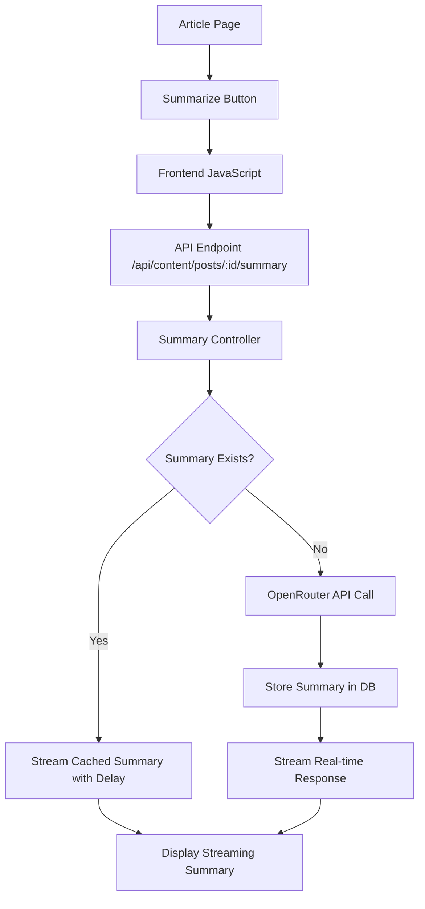

# Design Document

## Overview

The AI Article Summarizer feature integrates seamlessly into Ghost's existing architecture by adding a new API endpoint for summary generation, a database model for storing summaries, and frontend components that extend the article page template. The feature leverages OpenRouter's API with the google/gemma-3-27b-it:free model to generate summaries while maintaining security by keeping the API key server-side only.

The implementation follows Ghost's established patterns:
- Backend API endpoint following Ghost's controller pattern
- Database model using Bookshelf ORM
- Frontend integration using Ghost's theme system and helpers
- Caching mechanism to prevent redundant API calls

## Architecture

### High-Level Architecture



### Component Interaction Flow

1. **Page Load**: Article page loads with hidden summary component and visible "Summarize" button
2. **User Interaction**: User clicks "Summarize" button, summary component is revealed
3. **API Request**: Frontend makes request to `/api/content/posts/:id/summary`
4. **Cache Check**: Backend checks if summary exists for the post
5. **Response Streaming**: 
   - If cached: Backend introduces slight delay and streams existing summary character by character
   - If new: Backend calls OpenRouter API and streams real-time response
6. **Storage**: If newly generated, stores summary in database
7. **UI Update**: Frontend displays streaming text in real-time to simulate AI generation

## Components and Interfaces

### Backend Components

#### 1. Summary API Endpoint
- **Location**: `ghost/core/core/server/api/endpoints/post-summaries.js`
- **Purpose**: Handle summary generation and retrieval requests with streaming response
- **Methods**: 
  - `read`: Get or generate summary for a specific post, always stream response
- **Authentication**: Public endpoint (no authentication required)
- **Streaming**: Always streams response to simulate AI generation (cached or real-time)
- **Caching**: Integrated with Ghost's existing cache system

#### 2. Summary Model
- **Location**: `ghost/core/core/server/models/post-summary.js`
- **Purpose**: Database model for storing post summaries
- **Fields**:
  - `id`: Primary key
  - `post_id`: Foreign key to posts table
  - `summary`: Generated summary text
  - `created_at`: Timestamp
  - `updated_at`: Timestamp
- **Relationships**: Belongs to Post model

#### 3. OpenRouter Service
- **Location**: `ghost/core/core/server/services/openrouter/`
- **Purpose**: Handle API communication with OpenRouter and simulate streaming for cached responses
- **Features**:
  - Hardcoded API key (secure server-side storage)
  - Real-time streaming for new summaries
  - Simulated streaming for cached summaries (with artificial delay)
  - Error handling and retry logic
  - Rate limiting compliance

#### 4. Database Migration
- **Location**: `ghost/core/core/server/data/migrations/`
- **Purpose**: Create post_summaries table
- **Schema**:
  ```sql
  CREATE TABLE post_summaries (
    id VARCHAR(24) PRIMARY KEY,
    post_id VARCHAR(24) NOT NULL,
    summary TEXT NOT NULL,
    created_at DATETIME NOT NULL,
    updated_at DATETIME NOT NULL,
    FOREIGN KEY (post_id) REFERENCES posts(id) ON DELETE CASCADE,
    UNIQUE KEY unique_post_summary (post_id)
  );
  ```

### Frontend Components

#### 1. Summary Component (JavaScript)
- **Location**: `ghost/core/core/frontend/src/article-summarizer/`
- **Purpose**: Handle UI interactions and API communication
- **Features**:
  - Button click handling (reveals component immediately)
  - API request management
  - Streaming response processing (character-by-character display)
  - Component visibility toggling (hidden by default)
  - Error state handling
  - Responsive design
  - Simulated typing effect for all responses

#### 2. Summary Helper
- **Location**: `ghost/core/core/frontend/helpers/article_summary.js`
- **Purpose**: Handlebars helper for rendering summary components
- **Usage**: `{{article_summary}}`
- **Output**: Renders summary button and container HTML

#### 3. CSS Styles
- **Location**: `ghost/core/core/frontend/public/ghost.css`
- **Purpose**: Styling for summary component
- **Features**:
  - Responsive design (desktop/mobile)
  - Smooth animations for reveal/hide
  - Scrollable content area
  - Consistent with Ghost's design system

## Data Models

### Post Summary Model

```javascript
// ghost/core/core/server/models/post-summary.js
const ghostBookshelf = require('./base');

const PostSummary = ghostBookshelf.Model.extend({
    tableName: 'post_summaries',
    
    defaults: function defaults() {
        return {
            id: ghostBookshelf.Model.generateId()
        };
    },

    post: function post() {
        return this.belongsTo('Post', 'post_id');
    }
}, {
    findByPostId: function findByPostId(postId, options) {
        return this.findOne({post_id: postId}, options);
    }
});

module.exports = {
    PostSummary: ghostBookshelf.model('PostSummary', PostSummary)
};
```

### API Response Format

```javascript
// Success Response
{
    "post_summaries": [{
        "id": "summary_id",
        "post_id": "post_id", 
        "summary": "Generated summary text...",
        "created_at": "2024-01-01T00:00:00.000Z",
        "updated_at": "2024-01-01T00:00:00.000Z"
    }]
}

// Error Response
{
    "errors": [{
        "message": "Summary generation failed",
        "type": "InternalServerError"
    }]
}
```

## Error Handling

### Backend Error Scenarios
1. **Post Not Found**: Return 404 with appropriate error message
2. **OpenRouter API Failure**: Return 500 with generic error message (don't expose API details)
3. **Database Connection Issues**: Return 500 with database error
4. **Rate Limiting**: Return 429 with retry-after header
5. **Invalid Post Content**: Return 400 with validation error

### Frontend Error Handling
1. **Network Errors**: Display "Connection failed" message
2. **Server Errors**: Display "Summary generation failed" message
3. **Timeout**: Display "Request timed out" message with retry option
4. **Invalid Response**: Display generic error message

### Error Recovery
- Automatic retry for transient failures (network timeouts)
- Graceful degradation (hide summary feature if critical errors)
- User-friendly error messages (no technical details exposed)

## Testing Strategy

### Unit Tests
1. **Summary Model Tests**
   - CRUD operations
   - Relationship validation
   - Data integrity

2. **OpenRouter Service Tests**
   - API communication
   - Response parsing
   - Error handling
   - Mocking external API calls

3. **API Endpoint Tests**
   - Request validation
   - Response formatting
   - Error scenarios
   - Authentication (public access)

### Integration Tests
1. **End-to-End Summary Generation**
   - Full workflow from button click to display
   - Database persistence
   - Cache behavior

2. **Frontend Component Tests**
   - UI interactions
   - API communication
   - Responsive behavior
   - Error state handling

### Browser Tests
1. **Cross-Browser Compatibility**
   - Chrome, Firefox, Safari, Edge
   - Mobile browsers (iOS Safari, Chrome Mobile)

2. **Responsive Design Tests**
   - Desktop layouts
   - Tablet layouts  
   - Mobile layouts

3. **Accessibility Tests**
   - Keyboard navigation
   - Screen reader compatibility
   - ARIA labels and roles

### Performance Tests
1. **API Response Times**
   - Summary generation latency
   - Database query performance
   - Cache hit/miss ratios

2. **Frontend Performance**
   - Component render times
   - Memory usage
   - Bundle size impact

## Security Considerations

### API Key Protection
- OpenRouter API key stored as environment variable
- Never exposed to client-side code
- Secure server-side configuration management
- No user interface for API key modification

### Input Validation
- Post ID validation (prevent injection attacks)
- Content length limits for summary generation
- Rate limiting to prevent abuse

### Data Privacy
- No personal information sent to OpenRouter
- Only article content used for summarization
- Summary data stored securely in Ghost database

### Access Control
- Public endpoint (no authentication required)
- Post visibility respected (published posts only)
- No sensitive data exposure in error messages

## Performance Optimization

### Caching Strategy
- Database-level caching for existing summaries
- Integration with Ghost's existing cache system
- Cache invalidation on post updates
- TTL-based cache expiration

### API Optimization
- Streaming responses for real-time user feedback
- Connection pooling for OpenRouter API
- Request queuing to handle concurrent requests
- Graceful handling of API rate limits

### Frontend Optimization
- Lazy loading of summary component JavaScript
- Minimal CSS footprint
- Efficient DOM manipulation
- Debounced user interactions

### Database Optimization
- Indexed foreign key relationships
- Efficient query patterns
- Connection pooling
- Query result caching
